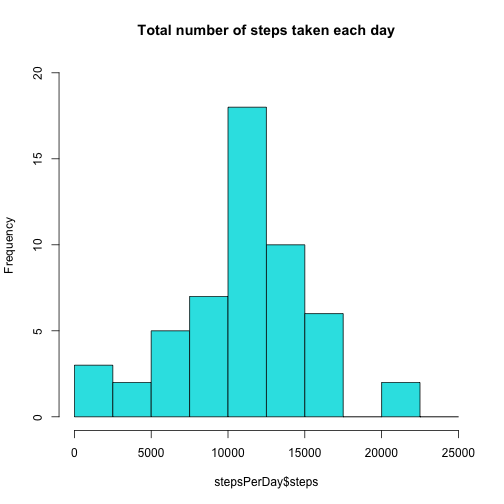
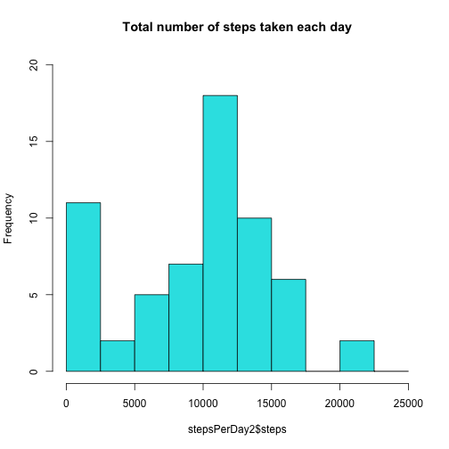
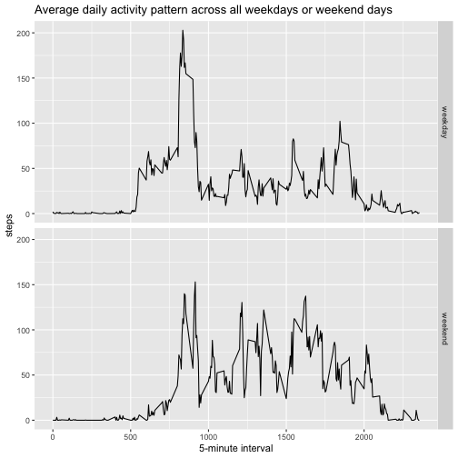

Course Project 1 Reproducible Research
=========================================
Jersai


## Loading and preprocessing the data 


* Load the data

```r
library(ggplot2)
activity <- read.csv("activity.csv")
```


##  What is mean total number of steps taken per day?


* Calculate the total number of steps taken per day

```r
stepsPerDay <- aggregate(steps ~ date, activity, sum, na.rm=TRUE)
stepsPerDay
```

```
##          date steps
## 1  2012-10-02   126
## 2  2012-10-03 11352
## 3  2012-10-04 12116
## 4  2012-10-05 13294
## 5  2012-10-06 15420
## 6  2012-10-07 11015
## 7  2012-10-09 12811
## 8  2012-10-10  9900
## 9  2012-10-11 10304
## 10 2012-10-12 17382
## 11 2012-10-13 12426
## 12 2012-10-14 15098
## 13 2012-10-15 10139
## 14 2012-10-16 15084
## 15 2012-10-17 13452
## 16 2012-10-18 10056
## 17 2012-10-19 11829
## 18 2012-10-20 10395
## 19 2012-10-21  8821
## 20 2012-10-22 13460
## 21 2012-10-23  8918
## 22 2012-10-24  8355
## 23 2012-10-25  2492
## 24 2012-10-26  6778
## 25 2012-10-27 10119
## 26 2012-10-28 11458
## 27 2012-10-29  5018
## 28 2012-10-30  9819
## 29 2012-10-31 15414
## 30 2012-11-02 10600
## 31 2012-11-03 10571
## 32 2012-11-05 10439
## 33 2012-11-06  8334
## 34 2012-11-07 12883
## 35 2012-11-08  3219
## 36 2012-11-11 12608
## 37 2012-11-12 10765
## 38 2012-11-13  7336
## 39 2012-11-15    41
## 40 2012-11-16  5441
## 41 2012-11-17 14339
## 42 2012-11-18 15110
## 43 2012-11-19  8841
## 44 2012-11-20  4472
## 45 2012-11-21 12787
## 46 2012-11-22 20427
## 47 2012-11-23 21194
## 48 2012-11-24 14478
## 49 2012-11-25 11834
## 50 2012-11-26 11162
## 51 2012-11-27 13646
## 52 2012-11-28 10183
## 53 2012-11-29  7047
```


* Make a histogram of the total number of steps taken each day

```r
hist(stepsPerDay$steps, breaks= seq(0,25000,by=2500), ylim=c(0,20), col=5, main="Total number of steps taken each day")
```




* Calculate and report the mean and median of the total number of steps taken per day

```r
mean(stepsPerDay$steps)
```

```
## [1] 10766.19
```

```r
median(stepsPerDay$steps)
```

```
## [1] 10765
```


##  What is the average daily activity pattern?


*  Make a time series plot of the 5-minute interval (x-axis) and the average number of steps taken, averaged across al days (y-axis)

```r
stepsPerInterval <- aggregate(steps ~ interval, activity, mean, na.rm=TRUE)
g <- ggplot(data= stepsPerInterval, aes(x=interval, y=steps))
g <- g + geom_line() + labs(x="5-minute interval", y="steps",title="Average daily activity pattern")
print(g)
```


* Which 5-minute interval, on average across all the days in the dataset, contains the maximum number of steps?

```r
stepsPerInterval[which.max(stepsPerInterval$steps), ]$interval
```

```
## [1] 835
```


## Imputing missing values


* Calculate and report the total number of missing values in the dataset (i.e. the total number of rows with NAs)

```r
NASteps <- sum(is.na(activity$steps))
NASteps
```

```
## [1] 2304
```


* Devise a strategy for filling in all of the missing values in the dataset. In this case, we will be evaluating, using skewness function, whether the variable steps has a symmetric distribution or not. If skewness is different than 0, missing values will be imputed using the median, otherwise the mean will be used.

```r
library(moments)
skewness(activity$steps,na.rm=TRUE) 
```

```
## [1] 4.171477
```

```r
medianSteps <- median(activity$steps,na.rm=TRUE)
```


* Create a new dataset that is equal to the original dataset but with the missing data filled in.

```r
activity2 <- activity
activity2$steps[is.na(activity2$steps)] <- medianSteps
```


* Make a histogram of the total number of steps taken each day and Calculate and report the mean and median total number of steps taken per day.

```r
stepsPerDay2 <- aggregate(steps ~ date, activity2, sum, na.rm=TRUE)
hist(stepsPerDay2$steps, breaks= seq(0,25000,by=2500), ylim=c(0,20), col=5, main="Total number of steps taken each day")
```




## Are there differences in activity patterns between weekdays and weekends?

* Create a new factor variable in the dataset with two levels – “weekday” and “weekend” indicating whether a given date is a weekday or weekend day.

```r
activity2$date <- as.Date(activity2$date)
activity2$day <- weekdays(activity2$date)
for (i in 1:nrow(activity2)) {
    if (activity2[i,]$day %in% c("Saturday","Sunday")) {
        activity2[i,]$day<-"weekend"
    }
    else{
        activity2[i,]$day<-"weekday"
    }
}
```


* Make a panel plot containing a time series plot of the 5-minute interval (x-axis) and the average number of steps taken, averaged across all weekday days or weekend days (y-axis)

```r
stepsPerInterval2 <- aggregate(steps ~ interval + day, activity2, mean, na.rm=TRUE)
g <- ggplot(data= stepsPerInterval2, aes(x=interval, y=steps))
g <- g + geom_line() + facet_grid(day~.) + labs(x="5-minute interval", y="steps",title="Average daily activity pattern across all weekdays or weekend days")
print(g)
```


